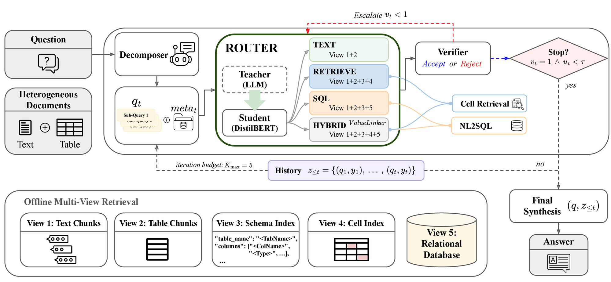

# Every Answer Has Its Own Path: Agentic Routing for Retrieval-Augmented Table Question Answering

[](LICENSE)
[](https://www.python.org/downloads/)

Repository for the EMNLP 2026 paper _"Every Answer Has Its Own Path: Agentic Routing for Retrieval-Augmented Table Question Answering"_.



## Introduction

- We identify two failure modes of existing agentic table-text QA systems: they commit to a single execution strategy at the question level, and they suffer a **soft-retrieval / hard-execution gap**, where embedding retrieval ranks the correct cell as a candidate yet SQL execution still misses the row because the question's surface form never matches the stored value.
- We propose **ATR (AgenticTableRAG)**, which decomposes a question into sub-queries and routes each one to `TEXT` / `RETRIEVE` / `SQL` / `HYBRID` over a shared 5-view index. A **HybridValueLinker** grounds entity mentions to values that exist in the cell index before any SQL is issued, and a verifier rejects weak sub-answers and re-invokes the router with the failed-route history.
- The routing policy is distilled into a **DistilBERT student** that recovers 98.6% of the LLM teacher's decisions at zero per-sub-query LLM cost. A single configuration leads on token F1 across HybridQA, TAT-QA, and WTQ, and transfers unchanged to MultiHiertt and SPARTA, which the router never saw.

## Setup

### Environment

```bash
git clone https://github.com/ayoung206/ATR.git && cd ATR
python -m venv .venv && source .venv/bin/activate
pip install -r requirements.txt

python -m atr.smoke               # 5-check install verification (~10 s)
```

### External dependencies

1. **Vertex AI service-account JSON** at `./vertexai.json` (or set `VERTEXAI_CREDENTIALS_PATH`).
2. **BGE-M3 embedder**: download from HuggingFace and pass the parent directory to `--bge_dir`:
   ```bash
   huggingface-cli download BAAI/bge-m3 --local-dir ./models/bge-m3
   ```
3. **The Flask SQL service** (for the `SQL` / `HYBRID` primitives). ATR does not
   ship it. Use the implementation released with TableRAG (Yu et al., EMNLP
   2025) and follow that repository's setup:
   ```bash
   git clone https://github.com/yxh-y/TableRAG/ tablerag
   cd tablerag/offline_data_ingestion_and_query_interface/src

   # MySQL: create a database + user, fill in that project's config, then
   # ingest your tables (once per benchmark) and start the service:
   python data_persistent.py --excel_dir $DATA_DIR/hybridqa/dev_excel/
   python interface.py                            # binds 0.0.0.0:5000
   ```
   Then `export SQL_SERVICE_URL=http://127.0.0.1:5000/get_tablerag_response`.

   You can run ATR without the SQL service if you only need the `TEXT` / `RETRIEVE` routes (the router will degrade gracefully).
4. **(Optional) Official TAT-QA evaluator**, needed only for Recipe B's EM/F1 numbers:
   ```bash
   git clone https://github.com/NExTplusplus/TAT-QA <somewhere>/TAT-QA
   export TATQA_DIR=<somewhere>/TAT-QA
   ```
   ATR's own relaxed/EM metric in `atr.evaluate` does not need this.

### Router checkpoint

Train the distilled DistilBERT router yourself with `atr.tools.train_router`
(step 3 under **Usage**, a few minutes on a single GPU), or point
`ATR_ROUTER_REPO` at any HuggingFace repo you control and fetch it with:

```bash
python -m atr.tools.download_router --out_dir ./models/atr_router
```

A hosted checkpoint will be linked here once it is up.

### Credentials safety

`vertexai.json` (GCP service-account) and any local database config are git-ignored. To get a second line of defence that aborts commits containing those files even if `.gitignore` is bypassed, opt in to the bundled pre-commit hook once:

```bash
git config core.hooksPath .githooks
```

### Data

This repository ships no benchmark data. Download each dataset from its
own release and convert it locally:

| Benchmark            | Upstream                                         | License        |
|----------------------|--------------------------------------------------|----------------|
| HybridQA             | https://github.com/wenhuchen/HybridQA            | CC BY-SA 4.0   |
| TAT-QA               | https://github.com/NExTplusplus/TAT-QA           | MIT            |
| WikiTableQuestions   | https://ppasupat.github.io/WikiTableQuestions/   | CC BY 4.0      |

```bash
export DATA_DIR=/path/to/your/data          # used by every command below

# TAT-QA and WTQ need converting into the (excel dir, doc dir, flat json) layout
python scripts/convert_tatqa.py \
    --src /path/to/tatqa_dataset_dev.json --out_dir $DATA_DIR
python scripts/convert_wtq.py \
    --wtq_dir /path/to/WikiTableQuestions --out_dir $DATA_DIR
```

That writes `$DATA_DIR/tatqa_excel/`, `$DATA_DIR/tatqa_doc/`,
`$DATA_DIR/tatqa_dev_flat.json`, `$DATA_DIR/wtq_excel/` and
`$DATA_DIR/wtq_unseen_flat.json`. HybridQA is already in that layout after
download. When you report numbers on any of these benchmarks, please cite the
original paper in addition to ATR.

## Repository layout

```
ATR/
├── atr/                       # Core package
│   ├── config.py              # Vertex / OpenAI backbones, default hyperparameters
│   ├── prompt.py              # All LLM prompts used by ATR
│   ├── build_index.py         # Offline 5-view index builder (CLI)
│   ├── evaluate.py            # Rule + LLM-judge evaluator
│   ├── online/                # Online inference loop (Algorithm 1)
│   │   ├── main.py            # Entry point: AgenticTableRAGAgent.run_single
│   │   ├── decomposer.py      # Question → ordered SubQuery list
│   │   ├── router.py          # Heuristic / LLM / learned / fixed routers
│   │   ├── value_linker.py    # HybridValueLinker (embedding + LLM verify)
│   │   ├── constrained_sql.py # (C, V*)-constrained SQL executor
│   │   └── verifier.py        # EvidenceFusionVerifier + escalation
│   ├── offline/
│   │   └── multiview_index.py # 5-view index (Text / Table / Schema / Cell / SQL)
│   ├── clients/               # LLM client, SQL-service client, BGE-M3 embedder
│   ├── baselines/             # NaiveLLM / NaiveRAG / NaiveRAG-SC / ReAct
│   └── tools/
│       └── train_router.py    # DistilBERT learned-router training pipeline
├── scripts/                   # Index building, dataset conversion, TAT-QA eval
├── requirements.txt
├── .gitignore
└── .githooks/pre-commit       # Refuses to commit credential files
```

## Usage

### 1. Build the 5-view index

```bash
python -m atr.build_index \
    --excel_dir ./data/excel \
    --doc_dir   ./data/docs \
    --bge_dir   ./models \
    --save_path ./index/hybridqa_multiview \
    --budget    10000
```

`<bge_dir>/bge-m3/` must contain the BGE-M3 weights.

### 2. Run online inference (Algorithm 1)

```bash
python -m atr.online.main \
    --backbone        gemini \
    --data_file_path  ./data/hybridqa_shard50_B.json \
    --index_path      ./index/hybridqa_multiview \
    --bge_dir         ./models \
    --router_type     learned \
    --router_model_path ./models/atr_router_distilbert \
    --max_iter 5 --device cuda --require_cuda \
    --final_synthesis
```

Useful flags:
- `--router_type {heuristic, llm, learned, fixed}`: pick the routing policy.
- `--force_route HYBRID` (with `--router_type fixed`): ablate to a single primitive.
- `--no_decomposition`: run the loop on the raw question (collapse to K_max=1).
- `--verifier_threshold 0.2`: uncertainty cutoff for the stop controller.
- `--decomposer_backbone <key>`: drive only the decomposer with another backbone (rest stays on `--backbone`); decomposer-model robustness in Table 4.
- `--verifier_backbone <key>`: drive only the verifier verdict with another backbone; verifier-model robustness in Table 4.
- `--oracle_verifier`: upper bound, returning any produced candidate matching the gold, measuring the accuracy ceiling a perfect verifier could reach.

### 3. Train the learned router

```bash
# (a) Teacher labels. Either distil them from an LLM router run directly...
python -m atr.tools.train_router distill \
    --data_file $DATA_DIR/hybridqa_shard50_B.json \
    --backbone  gemini \
    --out_file  labels/router_labels_hybridqa.jsonl

# ...or recover them from a completed LLM-routed inference log:
python -m atr.tools.train_router from_inference \
    --inference_log output/atr_hybridqa_llm.jsonl \
    --out_file      labels/router_labels_hybridqa.jsonl

# (b) Fine-tune DistilBERT
python -m atr.tools.train_router train \
    --oracle_file labels/router_labels_hybridqa.jsonl \
    --output_dir  ./models/atr_router_distilbert \
    --epochs 5

# (c) Evaluate the student against the teacher's labels
python -m atr.tools.train_router eval \
    --model_dir   ./models/atr_router_distilbert \
    --oracle_file labels/router_labels_hybridqa.jsonl
```

### 4. Evaluate inference outputs

```bash
python -m atr.evaluate \
    --result_file_path ./outputs/atr_hybridqa.jsonl

# TAT-QA needs multi-span / scale-aware metrics:
python scripts/eval_tatqa.py --result_file ./outputs/atr_tatqa.jsonl
```

## Reproducing the paper

> Headline numbers (Full ATR with Gemini 2.5 Flash, K_max = 5, learned router):
> **HybridQA dev**: EM 40.83, Relaxed 61.59, token F1 54.02, LLM Judge 54.02.

The recipes below assume you have completed **Setup**, started the SQL
service, and downloaded the BGE-M3 embedder and a router checkpoint. All
commands are run from the repo root.

### Recipe A. HybridQA dev (Table 1 headline)

```bash
# 1. Ingest HybridQA tables into MySQL
# (run inside your TableRAG service checkout)
python data_persistent.py --excel_dir $DATA_DIR/hybridqa/dev_excel/

# 2. Build the 5-view index (~10 min on a single A6000)
python -m atr.build_index \
    --excel_dir $DATA_DIR/hybridqa/dev_excel \
    --doc_dir   $DATA_DIR/hybridqa/dev_doc \
    --bge_dir   ./models \
    --save_path index/hybridqa_multiview --budget 10000

# 3. Run online inference (~30 min, ≈1 LLM call/sub-query)
python -m atr.online.main \
    --backbone        gemini \
    --data_file_path  $DATA_DIR/hybridqa_shard50_B.json \
    --index_path      index/hybridqa_multiview \
    --bge_dir         ./models \
    --router_type     learned \
    --router_model_path ./models/atr_router \
    --max_iter 5 --device cuda --require_cuda \
    --final_synthesis \
    --save_file_path output/atr_hybridqa.jsonl

# 4. Score
python -m atr.evaluate --result_file_path output/atr_hybridqa.jsonl
#    → expect token F1 ≈ 54.02, Relaxed ≈ 61.59 (±1 pp; LLM-judge noise)
```

### Recipe B. TAT-QA dev (Table 1)

```bash
# Assumes the SQL service has been re-pointed at a TAT-QA MySQL database.
# 1. Build index over TAT-QA tables + passages
python -m atr.build_index \
    --excel_dir $DATA_DIR/tatqa_excel \
    --doc_dir   $DATA_DIR/tatqa_doc \
    --bge_dir   ./models \
    --save_path index/tatqa_multiview --budget 10000

# 2. Run + evaluate with the TAT-QA-aware multi-span metric
python -m atr.online.main \
    --backbone        gemini \
    --data_file_path  $DATA_DIR/tatqa_dev_flat.json \
    --index_path      index/tatqa_multiview \
    --bge_dir         ./models \
    --router_type     learned \
    --router_model_path ./models/atr_router \
    --max_iter 5 --device cuda --require_cuda \
    --final_synthesis \
    --save_file_path output/atr_tatqa.jsonl

python scripts/eval_tatqa.py --result_file output/atr_tatqa.jsonl
```

The official TAT-QA evaluator is invoked at the end of `scripts/eval_tatqa.py`; if it
is not on your `PYTHONPATH`, set `TATQA_DIR` to a checkout of
https://github.com/NExTplusplus/TAT-QA.

### Recipe C. WTQ unseen-dev (Table 1)

Identical to Recipe A but with `$DATA_DIR/wtq_unseen_flat.json`,
`$DATA_DIR/wtq_excel/` and an `index/wtq_multiview` save path.

### Recipe D. Cross-backbone matrix (Table 2, backbone block)

Repeat Recipe A with `--backbone gemini-pro`, `--backbone claude-haiku-45`,
`--backbone gpt-4o-mini`, `--backbone llama33`, etc. The full set of backbone
keys is defined in `config_mapping` in `atr/config.py`.

### Recipe E. K_max saturation sweep

```bash
for K in 1 3 5 7 10; do
    python -m atr.online.main \
        --backbone gemini --data_file_path $DATA_DIR/hybridqa_shard50_B.json \
        --index_path index/hybridqa_multiview --bge_dir ./models \
        --router_type learned --router_model_path ./models/atr_router \
        --max_iter $K --final_synthesis --device cuda --require_cuda \
        --save_file_path output/atr_hybridqa_kmax${K}.jsonl
done
```

## Acknowledgements

ATR's `SQL` and `HYBRID` primitives execute against the Flask SQL service
released with **TableRAG** (Yu et al., EMNLP 2025),
https://github.com/yxh-y/TableRAG/. This repository ships no code from that
project; it speaks the service's HTTP interface and expects you to run the
service from its own release. Please cite their paper if you use it.

The multi-view index is built on **BGE-M3** (Chen et al., 2024) and the
benchmarks are HybridQA, TAT-QA, and WikiTableQuestions; cite those alongside
ATR when you report numbers.

## Citation

```bibtex
@inproceedings{kim2026atr,
  title     = {Every Answer Has Its Own Path: Agentic Routing for Retrieval-Augmented Table Question Answering},
  author    = {Kim, A Young and Shin, Jisu and Han, Donghee and Yi, Mun Yong},
  booktitle = {Proceedings of the 2026 Conference on Empirical Methods in Natural Language Processing},
  year      = {2026}
}
```
